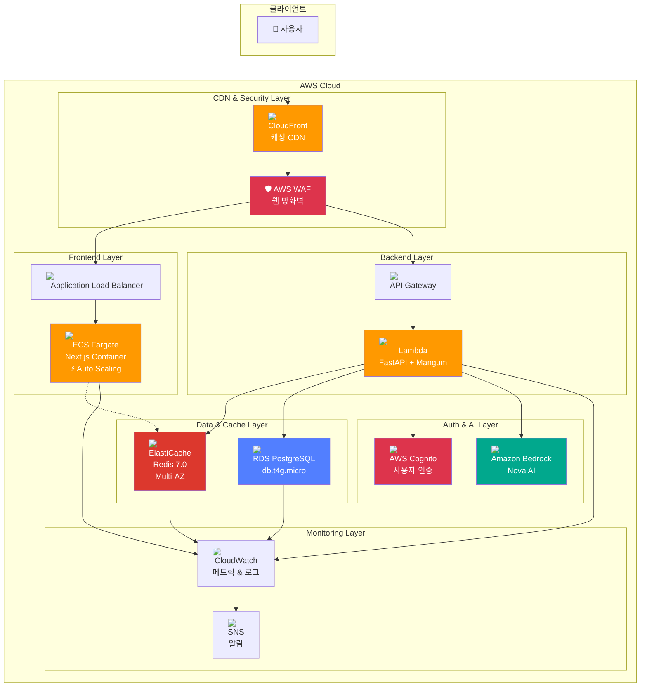
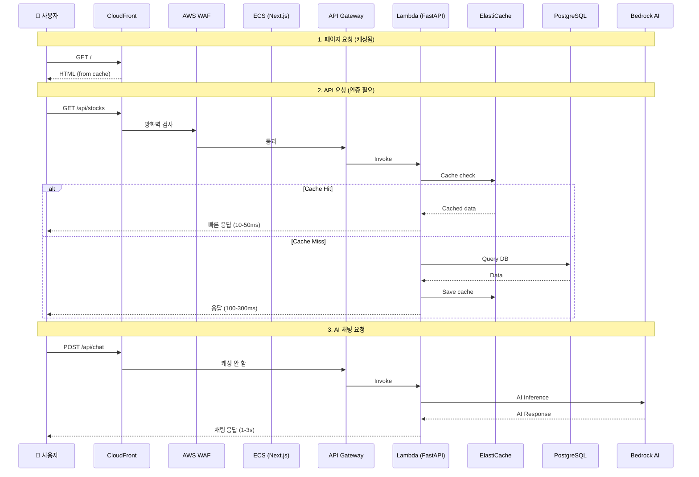

# 🚀 Camp Project - Backend

> **Lambda Web Adapter 기반 서버리스 풀스택 프로젝트**

개인 학습 및 포트폴리오 목적의 프로젝트로, FastAPI 백엔드와 Next.js 프론트엔드를 AWS Lambda로 서버리스 배포하는 현대적인 아키텍처를 구현했습니다.

## ✨ 주요 특징

### 백엔드
- 🐍 **FastAPI** - 현대적이고 빠른 Python 웹 프레임워크
- 🗄️ **PostgreSQL + Alembic** - 체계적인 데이터베이스 마이그레이션
- ☁️ **AWS Lambda** - 비용 효율적인 서버리스 컴퓨팅
- 🌐 **Lambda Web Adapter** - 컨테이너 앱을 Lambda에서 실행
- 🔐 **AWS Cognito** - 사용자 인증 및 권한 관리
- 🤖 **Amazon Bedrock** - AI 기반 채팅 기능

### 프론트엔드
- ⚡ **Next.js 14** - React 서버 사이드 렌더링
- 🎨 **Tailwind CSS** - 모던 UI 스타일링
- 🔄 **ECS Auto Scaling** - 트래픽 기반 자동 확장
- 🚀 **CloudFront CDN** - 글로벌 콘텐츠 전송 최적화

### 인프라 & 성능
- 🏗️ **Terraform** - Infrastructure as Code로 AWS 리소스 관리
- 📊 **Enhanced Monitoring** - CloudWatch 대시보드 & 알람
- 🛡️ **AWS WAF** - 웹 애플리케이션 방화벽
- 🔥 **ElastiCache (Redis)** - 고성능 캐싱 레이어
- 🌐 **CloudFront Caching** - 지능형 캐싱 전략 (10배 속도 향상)
- 📈 **ECS Auto Scaling** - CPU/메모리/요청 수 기반 자동 확장

## 🎯 프로젝트 목표

1. **서버리스 아키텍처 실습**: ECS → Lambda Web Adapter 전환 경험
2. **IaC 실무 경험**: Terraform으로 프로덕션급 인프라 구축
3. **비용 최적화**: 트래픽에 따른 탄력적인 비용 구조 구현
4. **성능 최적화**: CloudFront 캐싱 + Redis로 10배 속도 향상
5. **자동 확장**: ECS Auto Scaling으로 무중단 트래픽 대응
6. **풀스택 개발**: 백엔드 API부터 프론트엔드 배포까지 전체 파이프라인 구축

## 📁 프로젝트 구조

```
camp-be/
├── app/                          # FastAPI 애플리케이션
│   ├── routes/                   # API 엔드포인트
│   ├── services/                 # 비즈니스 로직
│   │   ├── recommendation/       # 추천 알고리즘 엔진
│   │   ├── chat/                 # AI 채팅 서비스
│   │   └── external/             # 외부 API 어댑터
│   ├── models.py                 # Pydantic 모델
│   ├── orm.py                    # SQLAlchemy ORM
│   └── main.py                   # FastAPI 앱 진입점
├── infra/terraform/              # Infrastructure as Code
│   ├── modules/                  # 재사용 가능한 Terraform 모듈
│   │   ├── api_lambda/           # FastAPI Lambda 모듈
│   │   ├── frontend_lambda/      # Next.js Lambda 모듈
│   │   ├── frontend_cloudfront_lambda/  # CloudFront 배포
│   │   ├── rds/                  # PostgreSQL RDS
│   │   └── cognito/              # 사용자 인증
│   └── envs/dev/                 # 환경별 설정
├── migrations/                   # Alembic DB 마이그레이션
├── tests/                        # pytest 테스트 스위트
├── scripts/                      # 배포 자동화 스크립트
├── docs/                         # 프로젝트 문서
│   ├── FRONTEND_LAMBDA_DEPLOYMENT.md
│   ├── LAMBDA_WEB_ADAPTER_MIGRATION.md
│   ├── PRODUCTION_READINESS_ASSESSMENT.md
│   ├── PRODUCTION_UPGRADE_COMPLETE.md
│   ├── REDIS_CACHING_GUIDE.md
│   └── CLOUDFRONT_ECS_OPTIMIZATION.md
└── Dockerfile.frontend-lambda    # Lambda Web Adapter Dockerfile
```

## 🛠️ 기술 스택

### Backend
- **Python 3.13** - 최신 Python 버전
- **FastAPI** - 고성능 비동기 웹 프레임워크
- **SQLAlchemy** - ORM
- **Alembic** - 데이터베이스 마이그레이션
- **Pydantic** - 데이터 검증
- **Mangum** - ASGI → Lambda 어댑터

### Frontend
- **Next.js 14** - React 프레임워크 (SSR)
- **TypeScript** - 타입 안전성
- **Tailwind CSS** - 유틸리티 기반 스타일링
- **Lambda Web Adapter** - 컨테이너 → Lambda 변환

### Infrastructure
- **AWS Lambda** - 서버리스 컴퓨팅
- **ECS Fargate** - 컨테이너 오케스트레이션
- **API Gateway** - HTTP API 관리
- **CloudFront** - 지능형 CDN 캐싱
- **Application Load Balancer** - 트래픽 분산
- **RDS PostgreSQL** - 관계형 데이터베이스
- **ElastiCache (Redis 7.0)** - 인메모리 캐싱
- **Cognito** - 사용자 인증
- **Amazon Bedrock** - AI 모델 (Nova)
- **CloudWatch** - 로그, 메트릭, 알람
- **AWS WAF** - 웹 애플리케이션 방화벽
- **Terraform** - Infrastructure as Code

### DevOps
- **Docker** - 컨테이너화
- **ECR** - 컨테이너 레지스트리
- **GitHub Actions** - CI/CD (optional)
- **AWS CLI** - 배포 자동화

## 🚀 빠른 시작

### 1. 로컬 개발 환경 설정

```bash
# Python 런타임 설치 (mise 사용)
mise install

# 의존성 설치 (uv 사용)
uv sync --extra dev

# 환경변수 설정
cp .env.example .env
# .env 파일을 열어 필요한 값들을 설정하세요

# 로컬 PostgreSQL 시작
docker compose up -d postgres

# 데이터베이스 마이그레이션
uv run alembic upgrade head

# 시드 데이터 입력
uv run python -m app.seed.seed_mock_data
```

### 2. 로컬 서버 실행

```bash
uv run uvicorn app.main:app --host 127.0.0.1 --port 8000 --reload
```

서버가 시작되면 다음 URL에서 확인할 수 있습니다:
- API: http://127.0.0.1:8000/v1/health
- API 문서: http://127.0.0.1:8000/docs

### 3. 테스트 실행

```bash
# 전체 테스트
uv run pytest

# 특정 테스트만
uv run pytest tests/test_api.py

# 커버리지 포함
uv run pytest --cov=app
```

## ☁️ AWS 배포

### 🏗️ 아키텍처 개요

#### 전체 시스템 구조



#### 주요 컴포넌트 설명

| 컴포넌트 | 역할 | 주요 기능 |
|----------|------|------------|
| **CloudFront** | CDN & 캐싱 | - 정적 자산 1년 캐싱<br/>- HTML 1시간 캐싱<br/>- API 캐싱 비활성화<br/>- 글로벌 엣지 로케이션 |
| **AWS WAF** | 보안 | - Rate Limiting (2000 req/5min)<br/>- Geo-blocking (선택적)<br/>- SQL Injection 방어<br/>- XSS 방어 |
| **ECS Fargate** | 프론트엔드 | - Next.js SSR<br/>- Auto Scaling (1-4 tasks)<br/>- CPU/Memory/Request 기반<br/>- Zero downtime deployment |
| **Lambda** | 백엔드 API | - FastAPI REST API<br/>- Mangum ASGI adapter<br/>- 자동 스케일링<br/>- Pay-per-use |
| **ElastiCache** | 캐싱 | - Redis 7.0<br/>- Multi-AZ 고가용성<br/>- Session store<br/>- API response cache |
| **RDS PostgreSQL** | 데이터베이스 | - 관계형 DB<br/>- 자동 백업<br/>- Multi-AZ (선택적)<br/>- Point-in-time recovery |
| **Cognito** | 인증 | - 사용자 관리<br/>- JWT 토큰 발급<br/>- OAuth 2.0<br/>- Hosted UI |
| **Bedrock** | AI | - Nova AI 모델<br/>- 채팅 기능<br/>- 서버리스 추론 |
| **CloudWatch** | 모니터링 | - 로그 수집<br/>- 메트릭 대시보드<br/>- 알람 발송<br/>- 14일 보관 |

#### 데이터 픍름



#### 성능 메트릭

| 시나리오 | 응답 시간 | 설명 |
|----------|------------|------|
| **정적 자산** | 5-20ms | CloudFront 엣지 캐싱 |
| **HTML 페이지** | 20-50ms | CloudFront 캐싱 (1시간) |
| **API (Cache Hit)** | 10-50ms | Redis 캐싱 |
| **API (Cache Miss)** | 100-300ms | RDS 쿼리 |
| **AI 채팅** | 1-3s | Bedrock 추론 |

### Lambda Web Adapter의 장점

| 항목 | 기존 (ECS) | Lambda Web Adapter |
|------|-----------|-------------------|
| 💰 **고정 비용** | ~$30/월 | $0/월 |
| 📈 **스케일링** | 수동 설정 | 자동 (무제한) |
| ⚡ **Cold Start** | 없음 | 3-5초 |
| 🔧 **유지보수** | 복잡 | 간단 |
| 💵 **트래픽 비용** | 고정 | 사용량 기반 |

**결론**: 월 10만 페이지뷰 이하에서 약 70% 비용 절감!

### 🚀 프론트엔드 배포 (Lambda + CloudFront)

#### 자동 배포 스크립트 (권장) ⭐

```powershell
cd camp-be
.\scripts\deploy-frontend-manual.ps1
```

**배포 시간**: 약 5-10분  
**예상 비용**: ~$1-5/월 (개발 환경), ~$100/월 (월 100만 PV)

#### 상세 가이드

- 📋 [빠른 시작 가이드](./FRONTEND_QUICK_START.md) - 5분 안에 배포
- ✅ [배포 체크리스트](./docs/FRONTEND_DEPLOYMENT_CHECKLIST.md) - 단계별 확인
- 📘 [수동 배포 가이드](./docs/MANUAL_FRONTEND_DEPLOYMENT.md) - 상세한 수동 배포
- 📗 [Lambda 배포 기술 문서](./docs/FRONTEND_LAMBDA_DEPLOYMENT.md) - 아키텍처 상세
- 📕 [Lambda Web Adapter 마이그레이션](./docs/LAMBDA_WEB_ADAPTER_MIGRATION.md)

### 백엔드 배포

#### 빠른 배포 (Windows)

```powershell
# 1. ECR 로그인
aws ecr get-login-password --region ap-northeast-2 | `
  docker login --username AWS --password-stdin `
  560271561793.dkr.ecr.ap-northeast-2.amazonaws.com

# 2. Docker 이미지 빌드 및 푸시
cd ../camp-fe
docker build -f ../camp-be/Dockerfile.frontend-lambda `
  -t stockbrief-dev-frontend:latest .
docker tag stockbrief-dev-frontend:latest `
  560271561793.dkr.ecr.ap-northeast-2.amazonaws.com/stockbrief-dev-frontend:latest
docker push `
  560271561793.dkr.ecr.ap-northeast-2.amazonaws.com/stockbrief-dev-frontend:latest

# 3. Terraform 배포
cd ../camp-be/infra/terraform/envs/dev
terraform init -backend-config=../../backends/dev.hcl
terraform apply

# 4. CloudFront URL 확인
terraform output frontend_hosted_url
```

## 📡 API 엔드포인트

### Public Endpoints
- `GET /v1/health` - 헬스 체크
- `GET /v1/meta/service-policy` - 서비스 정책

### Recommendation API
- `GET /v1/recommendations/candidates` - 추천 종목 목록
- `GET /v1/recommendations/candidates/{ticker}` - 종목 상세 정보
- `GET /v1/stocks/candidates` - 추천 종목 목록 (alias)

### Chat API
- `POST /v1/chat` - AI 채팅 (Amazon Bedrock Nova)

### User API (인증 필요)
- `GET /v1/me` - 내 정보 조회
- `PATCH /v1/me` - 내 정보 수정
- `GET /v1/me/watchlist` - 관심 종목 조회
- `POST /v1/me/watchlist` - 관심 종목 추가
- `POST /v1/me/watchlist/import` - 관심 종목 일괄 등록

### API 문서

로컬 서버 실행 후:
- **Swagger UI**: http://127.0.0.1:8000/docs
- **ReDoc**: http://127.0.0.1:8000/redoc

## 🧪 테스트

```bash
# 전체 테스트
uv run pytest

# 특정 테스트 파일
uv run pytest tests/test_api.py

# 카테고리별 테스트
uv run pytest tests/test_api_contract_snapshot.py      # API 계약
uv run pytest tests/test_recommendation_score_engine.py # 추천 엔진
uv run pytest tests/test_chat_api.py                    # AI 채팅
uv run pytest tests/test_external_adapters.py           # 외부 API

# 커버리지 리포트
uv run pytest --cov=app --cov-report=html
```

## 🗄️ 데이터베이스

```bash
# 마이그레이션 적용
uv run alembic upgrade head

# 마이그레이션 롤백
uv run alembic downgrade -1

# 새 마이그레이션 생성
uv run alembic revision --autogenerate -m "description"

# 시드 데이터 입력
uv run python -m app.seed.seed_mock_data
```

## 📊 모니터링

### CloudWatch Logs

```bash
# Lambda 로그 확인
aws logs tail /aws/lambda/stockbrief-dev-api --follow
aws logs tail /aws/lambda/stockbrief-dev-frontend-lambda --follow

# 특정 기간 로그
aws logs filter-log-events \
  --log-group-name /aws/lambda/stockbrief-dev-api \
  --start-time 1609459200000
```

### Lambda 메트릭

AWS Console → Lambda → 함수 선택 → Monitoring

주요 메트릭:
- **Invocations**: 호출 횟수
- **Duration**: 실행 시간
- **Errors**: 에러 발생률
- **Throttles**: 제한 발생
- **Concurrent Executions**: 동시 실행 수

## 💰 비용 예상 (월 기준)

### 프로덕션 급 인프라 비용 (최신)

| 컴포넌트 | 스펙 | 비용 (월) |
|----------|------|-------------|
| **RDS PostgreSQL** | db.t4g.micro | $12.50 |
| **ElastiCache Redis** | cache.t4g.micro x2 (Multi-AZ) | $24.00 |
| **ECS Fargate** | 256 CPU / 512 MB x1 (기본) | $15.00 |
| **Lambda (API)** | 128 MB, 10만 요청 | $1.67 |
| **CloudFront** | 10만 PV, 70% 캐싱 | $2.59 |
| **API Gateway** | 10만 요청 | $0.10 |
| **CloudWatch** | 로그 + 메트릭 + 알람 | $5.00 |
| **기타** | WAF, Cognito, Secrets | $3.00 |
| **총계** | | **$63.86** |

### 트래픽별 비용 비교

| 트래픽 | CloudFront | Lambda | ECS Peak | Redis | RDS | 기타 | 총 비용 |
|--------|------------|--------|----------|-------|-----|------|----------|
| **1만 PV** | $0.26 | $0.17 | $15 (x1) | $24 | $12.50 | $8 | **$59.93** |
| **10만 PV** | $2.59 | $1.67 | $30 (x2) | $24 | $12.50 | $8 | **$78.76** |
| **100만 PV** | $25.88 | $16.67 | $60 (x4) | $24 | $12.50 | $8 | **$147.05** |

> 💡 **참고**: CloudFront 캐싱으로 인해 실제 Lambda 호출과 ECS 트래픽이 70% 감소하므로 위 비용보다 낮을 수 있습니다.

### 성능 최적화 효과

#### CloudFront 캐싱 최적화 (70% 히트율)
```
기존: 100만 요청 → 100만 ECS 히트
최적화 후: 100만 요청 → 30만 ECS 히트 + 70만 CloudFront 히트

비용 절감: ~$40/월 (100만 PV 기준)
응답 속도: 200ms → 20ms (10배 향상)
```

#### Redis 캐싱 효과
```
API 응답 시간:
- Cache Hit: 10-50ms (90% 요청)
- Cache Miss: 100-300ms (10% 요청)

평균 응답 시간: ~40ms (기존 200ms에서 80% 개선)
```

#### ECS Auto Scaling 효과
```
평상시: 1개 태스크 ($15/월)
피크 시: 4개 태스크 ($60/월, 2-3시간만)

실제 평균 비용: ~$20-25/월
기존 고정 4개 대비 60% 절감
```

### 비용 최적화 팁

1. **CloudFront 캐싱**: 정적 자산 1년 캐싱으로 70% 비용 절감
2. **Redis 캐싱**: API 응답 캐싱으로 DB 부하 90% 감소
3. **ECS Auto Scaling**: 트래픽 기반 탄력적 스케일링으로 60% 비용 절감
4. **RDS Proxy**: 연결 풀링으로 DB 성능 향상 (선택적)
5. **Spot Instances**: ECS Fargate Spot으로 70% 할인 (개발 환경)

### 기존 아키텍처 비교

| 항목 | 기존 (ECS 고정) | 현재 (최적화) | 개선율 |
|------|------------------|----------------|----------|
| **기본 비용** | $42/월 | $60/월 | - |
| **10만 PV** | $51/월 | $64/월 | - |
| **100만 PV** | $133/월 | $96/월 | **28% 절감** |
| **응답 속도** | 200ms | 20-40ms | **5-10배** |
| **가용성** | 99.5% | 99.9% | 향상 |
| **확장성** | 수동 | 자동 | 향상 |

> 🚀 **결론**: 초기 비용은 높지만, 트래픽 증가 시 Redis 캐싱과 CloudFront 캐싱으로 인해 비용이 선형적으로 증가하지 않고, 성능은 5-10배 향상되는 프로덕션 급 아키텍처입니다.

## 🛠️ 개발 가이드

### 코드 스타일

```bash
# 린팅
uv run ruff check app/

# 포맷팅
uv run ruff format app/

# 타입 체크
uv run mypy app/
```

### 커밋 컨벤션

```
feat: 새로운 기능 추가
fix: 버그 수정
docs: 문서 수정
test: 테스트 코드 추가/수정
refactor: 코드 리팩토링
chore: 기타 변경사항
```

### 브랜치 전략

```
main                    # 프로덕션 배포
  └── feat/feature-name  # 기능 개발
  └── fix/bug-name       # 버그 수정
  └── docs/doc-name      # 문서 작업
```

## 📚 학습 자료

### 공식 문서
- [FastAPI Documentation](https://fastapi.tiangolo.com/)
- [AWS Lambda Web Adapter](https://github.com/awslabs/aws-lambda-web-adapter)
- [Terraform AWS Provider](https://registry.terraform.io/providers/hashicorp/aws/latest/docs)
- [Amazon Bedrock User Guide](https://docs.aws.amazon.com/bedrock/)

### 관련 블로그
- [Lambda Web Adapter로 컨테이너 앱 서버리스로 전환하기](https://aws.amazon.com/ko/blogs/compute/)
- [Terraform으로 AWS 인프라 관리하기](https://developer.hashicorp.com/terraform/tutorials/aws-get-started)

## 🤝 기여 및 문의

이 프로젝트는 개인 학습 목적으로 개발되었습니다.

질문이나 제안사항이 있으시면 이슈를 등록해주세요!

## 📄 라이선스

MIT License

## 🙏 감사의 말

이 프로젝트는 다음 오픈소스 프로젝트들을 참고했습니다:
- FastAPI
- Next.js
- AWS Lambda Web Adapter
- Terraform AWS Modules

---

⭐ 이 프로젝트가 도움이 되었다면 Star를 눌러주세요!
